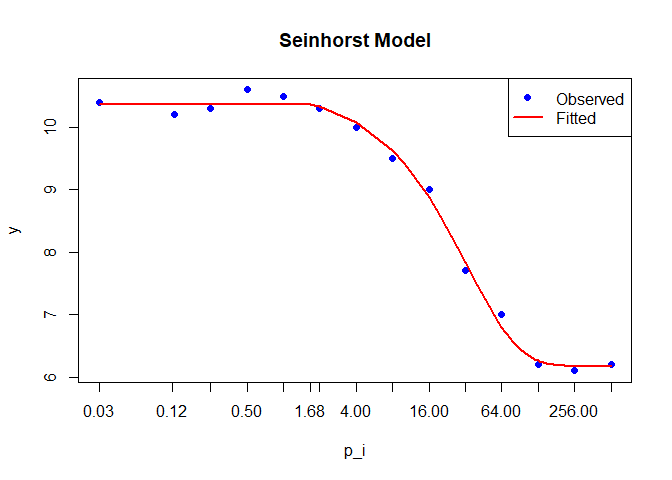

<!-- README.md is generated from README.Rmd. Please edit that file -->

# seinfitR: Modeling the Relationship Between Nematode Densities and Plant Growth

Authors:

Deoclecio Amorim - <amorim@cena.usp.br>, CENA-USP

João Novoletti - <joao.novoletti@gmail.com>

The goal of seinfitR is to fit the Seinhorst equation to experimental
data describing the relationship between preplant nematode densities and
plant growth using nonlinear least squares fitting.

## Installation

You can install the development version of seinfitR from
[GitHub](https://github.com/dslabcena/seinfitR) with:

``` r
# install.packages("pak")
pak::pak("dslabcena/seinfitR")
```

## Basic Use

The syntax of seinfitR is straightforward, with the main function being
seinfitR(…).

## Example

Modeling plant response to nematode densities using the “jambu” dataset:

``` r
library(seinfitR)

data(glasshouse, package = "seinfitR")

# Fit the model
model <- seinfitR(p_i = "p_i", y = "y", data = glasshouse,
                  start = list(m = 6, t = 6),
                  control = seinfitR_control(maxiter = 20), z_fixed = TRUE)

# View model summary
summary(model)
#> 
#> Seinhorst Model - Parameter Estimates
#> -----------------------------------------------------
#>         Estimate  Std. Error   t value     Pr(>|t|)
#> m      0.5951683 0.008177824  72.77832 4.096851e-16
#> t      1.6829177 0.116059892  14.50042 1.627030e-08
#> y_max 10.3675895 0.053752628 192.87596 9.127161e-21
#> -----------------------------------------------------
#> R2 - R squared (Coefficient of Determination):  0.9949782 
#> Adjusted_R2 - Adjusted R squared:  0.9940652 
#> -----------------------------------------------------
```

The seinfitR package provides some methods for model evaluation and
visualization:

``` r
# Print model coefficients
print(model)
#> 
#> Seinhorst Model Fit Summary
#> -----------------------------------------------------
#> Dependent Variable: y 
#> Predictor Variable: p_i 
#> Number of Observations: 14 
#> 
#>         Estimate  Std. Error   t value     Pr(>|t|)
#> m      0.5951683 0.008177824  72.77832 4.096851e-16
#> t      1.6829177 0.116059892  14.50042 1.627030e-08
#> y_max 10.3675895 0.053752628 192.87596 9.127161e-21
#> -----------------------------------------------------

# Extract variance-covariance matrix
vcov(model)
#>                   m            t         y_max
#> m      6.687681e-05 -0.000364986 -0.0001181826
#> t     -3.649860e-04  0.013469898 -0.0024948229
#> y_max -1.181826e-04 -0.002494823  0.0028893450

#Extract model coefficients
coef(model)
#>          m          t      y_max 
#>  0.5951683  1.6829177 10.3675895

# Calculate R-squared
r_squared(model)
#> $R2
#> [1] 0.9949782
#> 
#> $Adjusted_R2
#> [1] 0.9940652

# Calculate Plot
plot(model)
```



Methods Available for seinfitR Objects

``` r
methods(class = "seinfitR")
#> [1] coef      plot      predict   print     r_squared summary   vcov     
#> see '?methods' for accessing help and source code
```

License

The seinfitR package is licensed under the GNU General Public License,
version 3, see file LICENSE.md. © 2025 Deoclecio J. Amorim & João
Novoletti.
